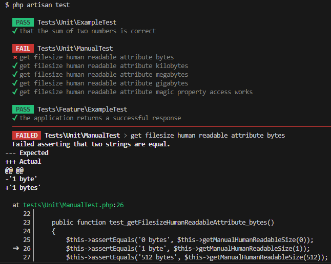

# Demonstratie Geautomatiseerd Testen

Deze repository is enkel bedoeld om te demonstreren hoe geautomatiseerd testen in zijn werk gaat. De code in deze repository is niet bedoeld om te gebruiken voor het 4S_Manuals project.

## Opstarten

1. Clone deze repository naar je lokale machine
2. Open de repository in je favoriete IDE
3. Open de terminal en voer het volgende commando uit: `composer install`
4. Kopieer het bestand `.env.example` en hernoem deze naar `.env`
5. Voer het volgende commando uit: `php artisan key:generate`
6. Vul de `.env` met geschikte database gegevens
7. Voer het volgende commando uit: `php artisan migrate`
10. Voer de tests uit met: `php artisan test`

Als het goed is slagen alle tests, op één na:


## Hoe de een *Unit test* is geschreven voor `getFilesizeHumanReadableAttribute()` in het `Manual`-model

Je kunt de tests nu vinden in `tests/Unit/ManualTest.php`. Dit is hoe ze tot stand zijn gekomen:

1. We maken de test: `php artisan make:test ManualTest --unit`
2. Open de test in de map `tests/Unit/ManualTest.php`
3. Bedenk en schrijf een eerste simpele test, bijvoorbeeld:
```php
use App\Models\Manual;

class ManualTest extends TestCase
{
    public function test_getFilesizeHumanReadableAttribute()
    {
        // Create an instance of the Manual class with a known filesize.
        $manual = new Manual();
        $manual->filesize = 1073741824; // 1GB

        // Call the method to get the human-readable filesize.
        $result = $manual->getFilesizeHumanReadableAttribute();

        // Assert that the result matches the expected output for 1GB.
        $this->assertEquals('1.00GB', $result);
    }
}
```
4. Voer de test uit met `php artisan test`

De test slaagt. Maar we willen ook testen of de methode werkt voor andere groottes. Vandaar schrijven we een kleine functie die ons helpt om code in de test te hergebruiken voor andere groottes.

```php
private function getManualHumanReadableSize($size)
{
    $manual = new Manual();
    $manual->filesize = $size;
    $result = $manual->getFilesizeHumanReadableAttribute();

    return $result;
}
```

Die kunnen we dan steeds hergebruiken in onze test:

```php
$this->assertEquals('1,023 bytes', $this->getManualHumanReadableSize(1023));
```

### Welke soorten waardes willen we testen?

**Probeer altijd de grenzen van de waardes op te zoeken. Dat zijn bijvoorbeeld waardes die:**
- Aan de ondergrens zitten
- Aan de bovengrens zitten
- In het midden zitten
- Net onder de ondergrens zitten
- Net boven de bovengrens zitten
- *Naast deze soorten waardes kunnen er meer soorten zijn die je wilt testen. Bekijk de situatie altijd zorgvuldig en bedenk welke waardes je wilt testen.*

**Bij het testen van een filesize kun je voor 'bytes' de volgende waardes bedenken:**
- 0 (we willen dat er '0 bytes' komt te staan)
- 1 (we willen dat er '1 byte' komt te staan)
- 512 (we willen dat er '512 bytes' komt te staan)
- 1023 (we willen dat er '1,023 bytes' komt te staan)
- 1024 (we willen dat er '1.00KB' komt te staan)
- 1025 (we willen dat er '1.00KB' komt te staan)
- -1 (we willen dat er een foutmelding komt)
